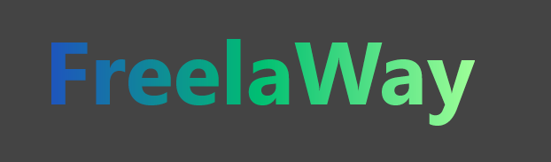
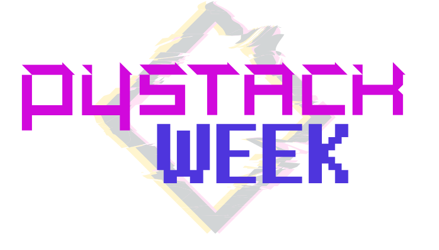
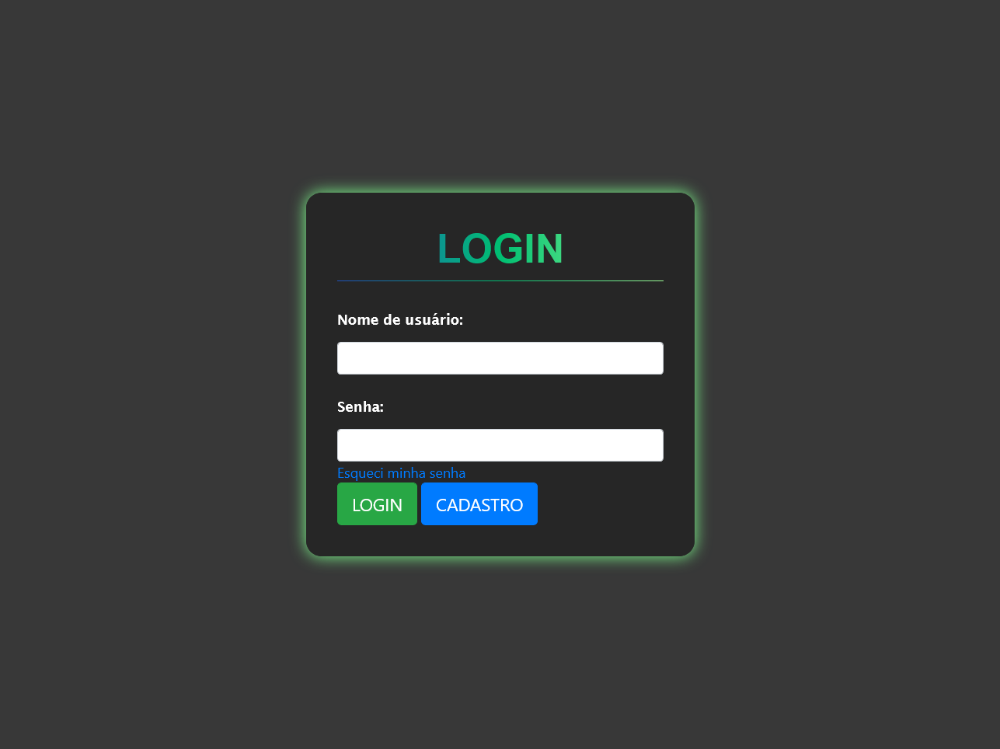
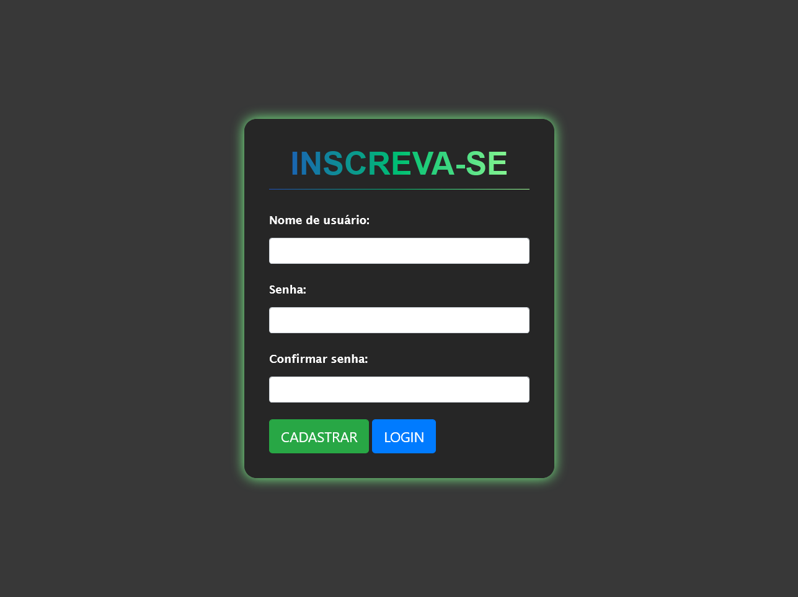
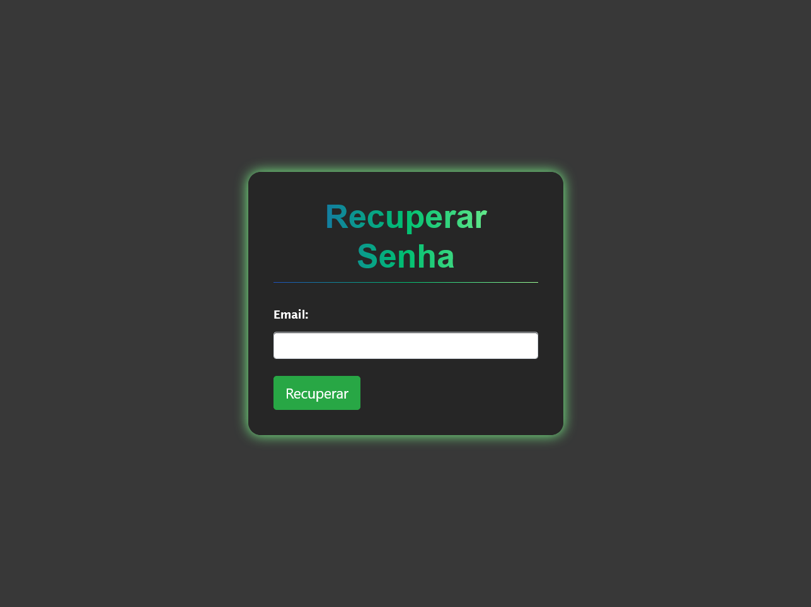
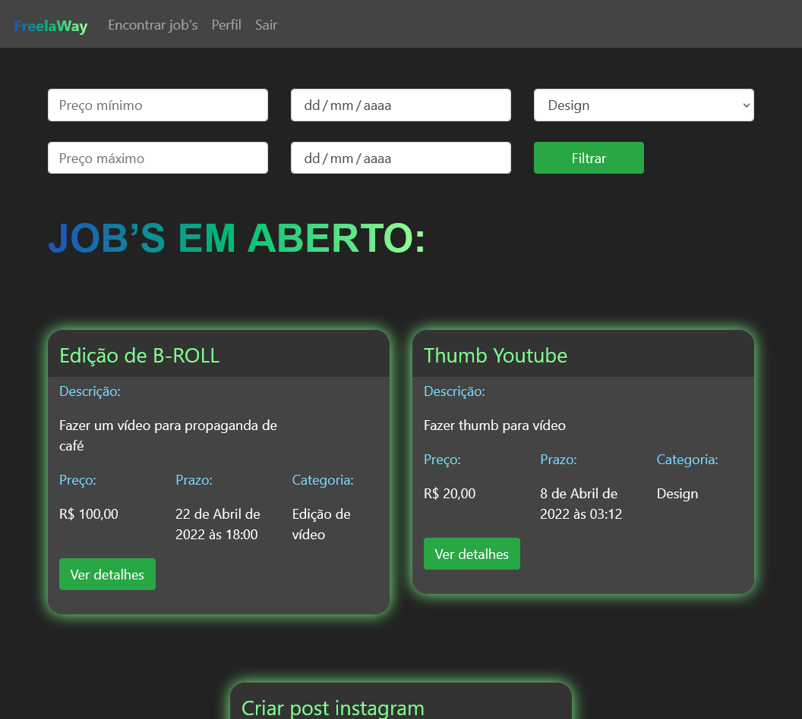
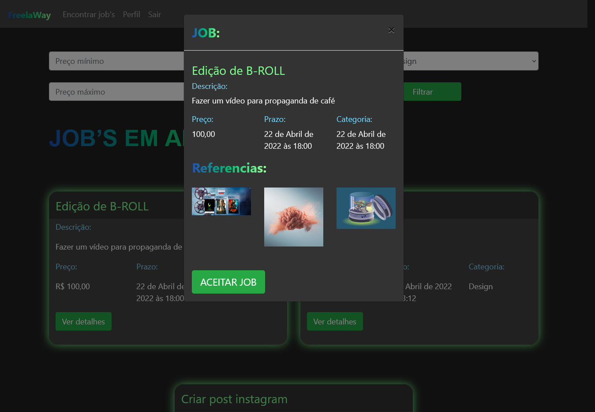
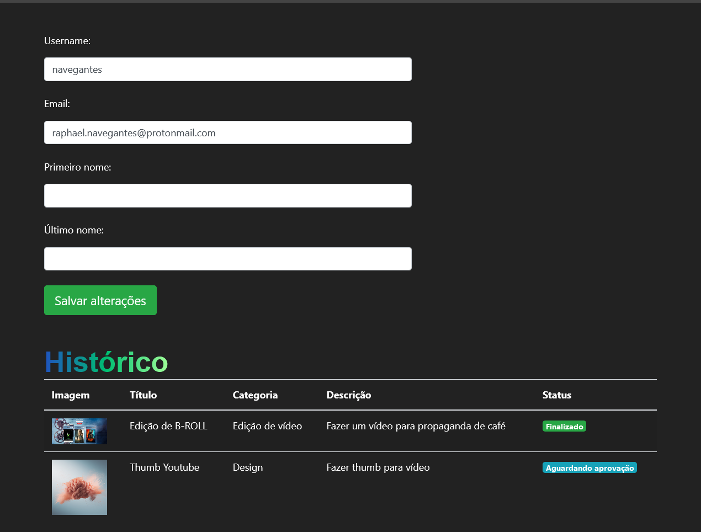

<div align="center" id="top"> 
  

<!-- &#xa0; -->

  <!-- <a href="https://freelaway.netlify.com">Demo</a> -->
</div>

<div align="center"> 
  <h1 align="center">Freelaway</h1>
  <!--  -->
</div>

<p>
  

  

  

  

  <!--  -->

  <!--  -->

  <!--  -->
</p>

<!-- Status -->

<!-- <h4 align="center">
	🚧  Freelaway 🚀 Em construção...  🚧
</h4>

<hr> -->

<p>
  <a href="#dart-sobre">Sobre</a> &#xa0; | &#xa0; 
  <a href="#sparkles-funcionalidades">Funcionalidades</a> &#xa0; | &#xa0;
  <a href="#rocket-tecnologias">Tecnologias</a> &#xa0; | &#xa0;
  <a href="#white_check_mark-pré-requisitos">Pré requisitos</a> &#xa0; | &#xa0;
  <a href="#checkered_flag-começando">Começando</a> &#xa0; | &#xa0;
  <a href="#memo-licença">Licença</a> &#xa0; | &#xa0;
  <a href="https://github.com/navegantes" target="_blank">Autor</a>
</p>

<p>
  
  
  
  
  
  
</p>

## 🎯 Sobre

O projeto inicial foi desenvolvido durante o evento [Pystack Week 3.0](https://pythonando.com.br).\
A proposta é criar um sistema de ofertas de trabalhos para contratar profissionais freelancer.

## ✨ Funcionalidades

✔️ Login/Logout;\
✔️ Cadastro de usuários;\
✔️ Recuperação de senha;

## 🚀 Tecnologias

As seguintes ferramentas foram usadas na construção do projeto:

- [Python](https://www.python.org/)
- [Django](https://nodejs.org/en/)
- [Bootstrap](https://getbootstrap.com/)

## ✅ Pré requisitos

Antes de começar 🏁, você precisa ter o [Python](https://www.python.org/downloads/) instalado em sua maquina.

## 🏁 Começando

1 - Primeiro clone o repositório e entre na pasta do projeto.

```bash
# Clone este repositório
$ git clone https://github.com/navegantes/freelaway

# Entre na pasta
$ cd freelaway
```

2 - Segundo inicie um ambiente virtual

```bash
# Criar
	# Linux
		python3 -m venv venv
	# Windows
		python -m venv venv

#Ativar
	# Linux
		source venv/bin/activate
	# Windows
		venv/Scripts/Activate

# Caso algum comando retorne um erro de permissão execute o código e tente novamente:

	Set-ExecutionPolicy -Scope CurrentUser -ExecutionPolicy RemoteSigned
```

3 - Instale as dependências

```bash
# Instale as dependências
$ pip install -r requirements.txt

# Para iniciar o projeto
$ python manage.py runserver

# O app vai inicializar em <http://localhost:3000>
```

## 📝 Licença

Este projeto está sob licença MIT. Veja o arquivo [LICENSE](LICENSE) para mais detalhes.

Feito com ❤️ por <a href="https://github.com/navegantes" target="_blank">Raphael Navegantes</a>

&#xa0;

<a href="#top">Voltar para o topo</a>
